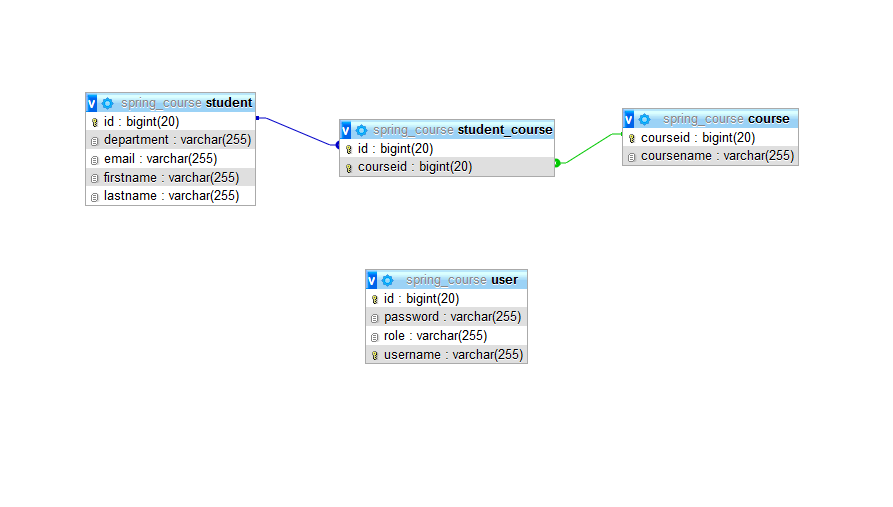

## Features

- CRUD
- ACL
- Validation
- Login
- Responsive

## Requirements

- NetBeans 8.2
- Java JDK 1.8
- Apache Tomcat >= 9
- MySql >=5

## Tecnologies

- Java
- JPA
- Maven
- Spring
- CSS
- Bootstrap
- MySql

https://java-spring-course.herokuapp.com/  

- Login
    - Username: admin
    - Password: admin

## Licence

User Registration is licensed under <a href="LICENSE">The MIT License (MIT)</a>.

## Screenshots

  
  
  
  
  
  
  
  

## Model ER

  

Developed by 
Tanisha Garg 

